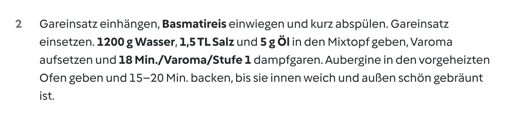

# Cookidoo Master

**Aus beliebigen Rezepten (HelloFresh-Karte, Kochbuch, Webseite) native-quality Cookidoo „Eigene Rezepte" machen — mit interaktiven Koch-Befehl-Chips, die der Thermomix automatisch abspielt.**

---

## Warum dieses Repo existiert

HelloFresh schickt jede Woche eine Box mit grandiosen Rezept-Kreationen. Auf manchen Karten steht hinten klein: **„Thermomix-Variante"**. Das klingt erst mal toll — aber in der Praxis ist diese „Variante" nichts weiter als der gleiche Fließtext mit ein paar zusätzlichen Hinweisen wie _„Wasser dazu, kochen"_. Es gibt:

- ❌ keine geführte Bedienung
- ❌ keine Chips für Zeit/Temperatur/Stufe
- ❌ keinen Start aus Cookidoo
- ❌ keine Verknüpfung mit dem Gerät

Wer eine echte Thermomix-Bedienung will, muss die Karte selbst am Display abtippen — Zutat für Zutat, Schritt für Schritt, jeden Koch-Befehl per Hand auswählen. Das ist genau das, was der Thermomix _eigentlich_ überflüssig machen sollte.

**Dieses Repo schließt die Lücke.** Es konvertiert beliebige Rezepte vollautomatisch in **native-quality Cookidoo-Eigene-Rezepte** — mit allem was ein originales Vorwerk-Rezept hat: strukturierte Zutaten, schrittweise Anleitung im Thermomix-Wording (`einwiegen`, `einhängen`, `aufsetzen`, `dampfgaren`) und vor allem **interaktive Koch-Befehl-Chips**, die der Thermomix beim Antippen direkt ausführt (`18 Min./Varoma/Stufe 1`, `6 Min./100 °C/Linkslauf/Stufe 1`).

## Die technische Entdeckung

Cookidoo hat eine **undokumentierte AI-Annotate-API** unter `POST /created-recipes/de-DE/annotate/steps`. Sie nimmt Plain-Text-Schritte entgegen und liefert eine strukturierte Token-Liste zurück: jede Zutaten-Mention wird zur `INGREDIENT`-Annotation, jeder Koch-Befehl zur `TTS`-Annotation. Wer diese API direkt anspricht (statt durch das versteckte 5-7-Klick-Modal pro Befehl zu navigieren), bekommt für seine Eigenen Rezepte **die gleiche Guided-Cooking-Erfahrung wie bei nativen Vorwerk-Rezepten**.

Komplettes Reverse-Engineering — DOM, Custom-Elements, Bundle-Strings, Save-Quirks — siehe [LEARNINGS.md](LEARNINGS.md).

## Status

✅ **Voll funktional + neun Rezepte öffentlich auf Cookidoo:**

| Karte | Rezept | Steps · Zutaten · Chips | Live auf Cookidoo | HelloFresh-Original |
|---|---|---|---|---|
| #18 | [Umami-Pilz-Stir-Fry mit Rosenkohl](recipes/umami-pilz-stir-fry-mit-rosenkohl/) | 12 · 19 · 2 (`Varoma` + `Stufe 3`) | [öffentlich](https://cookidoo.de/created-recipes/public/recipes/de-DE/01KRQ3TEB572NJEE7GB4FDRFG5) | [Original](https://www.hellofresh.de/recipes/umami-pilz-stir-fry-mit-rosenkohl-6904cb849140c7b54fef9a2e) |
| #25 | [Frische Sauerteig-Pinsa mit Aubergine](recipes/frische-sauerteig-pinsa-mit-aubergine/) | 10 · 16 · 2 (`Stufe 7` + `Pürieren`) | [öffentlich](https://cookidoo.de/created-recipes/public/recipes/de-DE/01KRQ44JTZ8ETRE7N6PBB4Q0Q8) | [Original](https://www.hellofresh.de/recipes/frische-sauerteig-pinsa-mit-aubergine-6978d31f6aaab04ab65108b0) |
| #25 | [Räuchertofu Gyros-Art mit Kartoffelsalat und Zaziki](recipes/raeuchertofu-gyros-art-mit-kartoffelsalat-und-zaziki/) | 13 · 18 · 4 (`Stufe 3` + `Stufe 7` + `Stufe 5`) | [öffentlich](https://cookidoo.de/created-recipes/public/recipes/de-DE/01KSMJK60SXV36SCX77T7N5ZV6) | [Original](https://www.hellofresh.de/recipes/souflaki-rauchertofu-mit-kartoffelsalat-and-zaziki-64e860a94e40d5c6cb1a53fe) |
| #32 | [Vegane Filetstücke in thailändischer Orangensoße](recipes/vegane-filetstuecke-thai-orange/) | 9 · 15 · 2 (`Varoma` + `Stufe 4`) | [öffentlich](https://cookidoo.de/created-recipes/public/recipes/de-DE/01KSMKBJ3XW0C5K5NYYVMVFZXC) | [Original](https://www.hellofresh.at/recipes/orange-chicken-vegan-68ac617f7e1f6c64ca682316) |
| #33 | [Sweet-Chili-Bowl mit glasierter Aubergine](recipes/sweet-chili-bowl/) | 15 · 17 · 2 (`Varoma` + `Linkslauf`) | [öffentlich](https://cookidoo.de/created-recipes/public/recipes/de-DE/01KRNNR72NTN1C0PTD67PA8W7D) | [Original](https://www.hellofresh.de/recipes/sweet-chili-bowl-mit-glasierter-aubergine-thermomix-695b7cae2a2e2effad1837dd) |
| #33 | [Veganes Portobello-Champignon-Stroganoff](recipes/veganes-portobello-champignon-stroganoff/) | 11 · 17 · 2 (`Linkslauf` + `Stufe 7`) | [öffentlich](https://cookidoo.de/created-recipes/public/recipes/de-DE/01KSMWEF8YNKG04Z4TTE9E72EA) | [Original](https://www.hellofresh.de/recipes/veganes-portobello-champignon-stroganoff-67dd36a6aaa74aa3f95880bf) |
| #64 | [Nasi Goreng mit veganen Filetstücken](recipes/nasi-goreng/) | 14 · 17 · 2 (`Varoma` + `Pürieren`) | [öffentlich](https://cookidoo.de/created-recipes/public/recipes/de-DE/01KRQ1JCX58H8QGDSBB47XVP5B) | [Original](https://www.hellofresh.de/recipes/nasi-goreng-mit-veganen-filetstucken-64e461d2e1f123211ed56789) |
| #66 | [Ingwer-Süßkartoffel-Eintopf mit Tofu](recipes/ingwer-suesskartoffel-eintopf-mit-tofu/) | 9 · 14 · 3 (`Stufe 7` + `Varoma` + `Linkslauf`) | [öffentlich](https://cookidoo.de/created-recipes/public/recipes/de-DE/01KRQ4A91QAT7SEKVZ5WK31JGW) | [Original](https://www.hellofresh.de/recipes/ingwer-susskartoffel-eintopf-mit-tofu-68fa30ecff3933d87e3fe9d9) |
| — | [Veganer Hackbraten mit Semmelknödeln, Schwarzbier-Pilz-Rahm & Apfel-Rotkohl](recipes/veganer-hackbraten-mit-semmelknoedeln-schwarzbier-pilz-rahm-und-apfel-rotkohl/) | 17 · 27 · 5 (`Linkslauf` + `Stufe 5` + `50 °C`) | [öffentlich](https://cookidoo.de/created-recipes/public/recipes/de-DE/01KRRA70F256JS1FJH8SHY4G6D) | Eigenkreation |

### Beweis: native-quality Chips im Rezept




> _`18 Min./Varoma/Stufe 1`, `6 Min./100 °C/Linkslauf/Stufe 1`, `10 Sek./Stufe 6`, `20 Min./Varoma/Stufe 1`, `30 Sek./Stufe 3` — alle keine Plain-Text-Strings, sondern interaktive Chips. Der Thermomix erkennt sie als ausführbare Koch-Befehle und führt sie beim Antippen direkt aus._

## Quick Start

Voraussetzungen einmalig:

```bash
brew install python3
pip3 install playwright
playwright install chromium

git clone https://github.com/meintechblog/thermomix-master.git
cd thermomix-master
python3 automation/00_setup_profile.py
# Im Browser bei cookidoo.de einloggen, Cookie-Banner akzeptieren, Fenster schließen.
# Login persistiert in ~/thermomix-automation/profile/ — danach nie wieder nötig.
```

### Option A — als Claude-Code-Skill (empfohlen)

Wenn du [Claude Code](https://claude.com/claude-code) nutzt: der Skill `thermomix-master` macht den kompletten Workflow zero-friction.

```bash
# Einmaliger Symlink:
ln -s "$(pwd)/skill/thermomix-master" ~/.claude/skills/thermomix-master
```

Pro neuem Rezept einfach in Claude Code aufrufen:

```
/thermomix-master https://www.hellofresh.de/recipes/<name>-<id>
```

Der Skill:
1. Scrapet die HelloFresh-Karte (Zutaten + Steps + Foto-URL + Nährwerte)
2. Skaliert auf 4 Portionen
3. Adaptiert auf native Thermomix-Style (kurze Ein-Aktion-Schritte — Step-Zahl = Anzahl Operationen, native Verben, spezifische Mengen, interaktive Koch-Befehl-Chips)
4. Auditiert per-step uniqueness + cross-step endings + chip-syntax
5. Holt von dir das eigene Foto + Bestätigung
6. Pipeline ausführen (01→06), Recipe live auf Cookidoo PUBLIC
7. README + Screenshots schreiben, commit + push

Auch mit `--text "<plain-recipe>"` oder `--image <path/to/photo.jpg>` als Input — siehe `skill/thermomix-master/SKILL.md`.

### Option B — manuell, Pipeline-Scripts direkt

```bash
# 1. Quellmaterial bereitlegen (eigenes Foto + slug-Verzeichnis)
mkdir -p recipes/{slug}
cp ~/eigenes-foto.jpg recipes/{slug}/hero.jpg

# 2. INGREDIENTS + STEPS in automation/01_create_recipe.py editieren
#    (Regel: eine AKTIVE Operation pro Step, Länge kein Hard-Cap — siehe PLAYBOOK.md Regel 8)

# 3. Pipeline durchlaufen (~2 Min. End-to-End):
python3 automation/01_create_recipe.py     # Anlage + Zutaten + Plain-Text-Steps
python3 automation/02_upload_image.py recipes/{slug}/hero.jpg   # Hero-Bild
python3 automation/03_add_tips.py          # Tipps (em-dash-Bullets + Quellen)
python3 automation/04_set_times.py         # Arbeitszeit + Gesamtzeit
python3 automation/05_annotate_chips.py    # 🪄 AI-Annotate → echte Chips
# Optional, nur mit EIGENEM Foto:
python3 automation/06_publish.py           # workStatus PUBLIC + Sharing-URL
```

Details + die 9 nicht-offensichtlichen Qualitätsregeln (per-step Uniqueness, Compound-Namen, Native-Verb-Vokabular, ...): siehe [PLAYBOOK.md](PLAYBOOK.md).

## Repo Layout

```
thermomix-master/
├── README.md             ← du bist hier — Why + Quick Start
├── PLAYBOOK.md           ← Schritt-für-Schritt pro neuem Rezept + die 9 Qualitätsregeln
├── LEARNINGS.md          ← Reverse-Engineering: APIs, DOM, Custom-Elements, Edge-Cases
├── automation/           ← 7 Pipeline-Scripts (00_setup_profile → 06_publish) + 1 Helper (99_replace_steps_helper)
├── skill/                ← Claude-Code-Skill `thermomix-master` (Symlink-bar nach ~/.claude/skills/)
├── research/             ← Native-Step-Korpus (2× 12 echte Cookidoo-Rezepte: Step-Struktur, Verben, Längen)
├── recipes/              ← Pro Rezept: Quellfoto, Markdown, Cookidoo-Link, Tipps-Narrativ
│   └── sweet-chili-bowl/ ← Das canonical example
└── docs/assets/          ← Screenshots fürs README
```

## Lizenz & Disclaimer

- **Code**: MIT
- **Rezeptbilder & -inhalte**: Original-Copyright bei HelloFresh / dem jeweiligen Rechteinhaber. Dieses Repo zeigt nur den technischen Workflow. Wer ein Rezept via diesem Toolset auf Cookidoo veröffentlichen will, muss **eigene Rechte am Bild haben** oder ein eigenes Foto verwenden. Die `06_publish.py`-Stage verlangt explizit den Toggle `isImageOwnedByUser: true` — das ist eine rechtliche Selbstzusicherung.
- Cookidoo® und Thermomix® sind eingetragene Marken der Vorwerk International AG & Co. KmG. Dieses Projekt ist **nicht** mit Vorwerk verbunden und nicht offiziell unterstützt.
- Die `/created-recipes/de-DE/annotate/steps`-API ist undokumentiert und kann sich jederzeit ändern. Use at your own risk.

## Mitmachen

Issues und PRs willkommen. Besonders gefragt:
- **Weitere Rezepte** als `recipes/{slug}/` mit eigenem Foto + Cookidoo-Link
- **Andere Lokale** (`en-US`, `fr-FR`, etc.) — die Annotate-API existiert per-Locale, die Verb-Vokabulare unterscheiden sich
- **Edge-Cases im Annotate-API** — bisher getestet: Bowls, Currys, Pfannen. Backrezepte (Mode-Glyphs für „Teig kneten"), Suppen (lange Garzeiten), Smoothies (kein TTS) stehen aus
