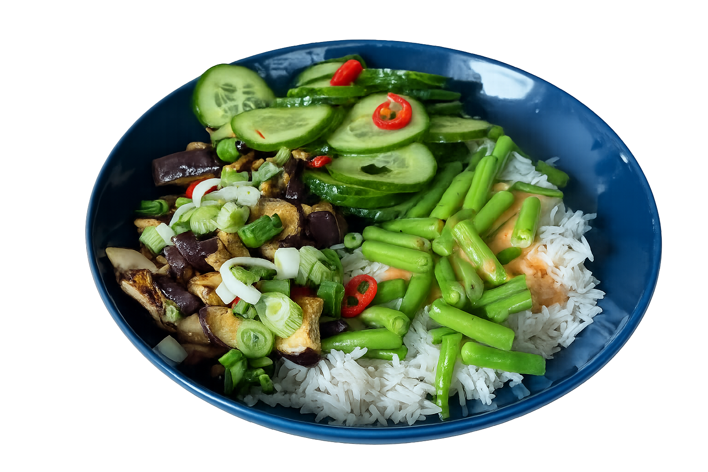

# Sweet-Chili-Bowl mit glasierter Aubergine

dazu Sesam-Reis, Gurkensalat & Sriracha-Mayo · vegan · ca. 610 kcal/Portion

## Kennzahlen

| | |
|---|---|
| **Quelle** | HelloFresh Wochenbox, Karte #33 |
| **Portionen** | 4 |
| **Arbeitszeit** | ca. 25 Min. |
| **Gesamtzeit** | ca. 35 Min. |
| **Schwierigkeit** | einfach |
| **Diät** | vegan |
| **Cookidoo-Rezept (privat, eingeloggt)** | https://cookidoo.de/created-recipes/de-DE/01KRNNR72NTN1C0PTD67PA8W7D |
| **Cookidoo-Rezept (öffentlich)** | https://cookidoo.de/created-recipes/public/recipes/de-DE/01KRNNR72NTN1C0PTD67PA8W7D |
| **Original HelloFresh-Rezept** | https://www.hellofresh.de/recipes/sweet-chili-bowl-mit-glasierter-aubergine-thermomix-695b7cae2a2e2effad1837dd |
| **Foto** | © Jörg Hofmann (eigene Aufnahme) |

## Zutaten (4P)

- 300 g Basmatireis
- 2 Auberginen
- 200 g Buschbohnen
- 2 Gurken
- 2 Frühlingszwiebeln
- 1 rote Chilischote, frisch
- 100 g Teriyakisoße
- 20 ml Sesamöl
- 16 ml Sriracha-Sauce
- 100 g Sweet-Chili-Soße
- 1 Limette, gewachst
- 50 g vegane Mayonnaise
- 1200 g Wasser
- 2 TL Salz
- 25 g Öl
- 1-2 Prisen Pfeffer
- 1 Prise Zucker

## Zubereitung — 5 Schritte mit interaktiven Koch-Befehlen

1. Limette in 6 Spalten schneiden. Aubergine längs vierteln und in ca. 2 cm Stücke schneiden, in einer großen Schüssel mit der Hälfte der Teriyakisoße, Saft von 2 Limettenspalten, 1 TL Salz und 2 EL Öl marinieren und auf einem mit Backpapier belegten Backblech verteilen. Enden der Buschbohnen entfernen und dritteln, in den Varoma-Behälter geben und verschließen. Backofen auf 220 °C Ober-/Unterhitze (200 °C Umluft) vorheizen.
2. Gareinsatz einhängen, Basmatireis einwiegen und kurz abspülen. Gareinsatz einsetzen. **1200 g Wasser**, **1,5 TL Salz** und 5 g Öl in den Mixtopf geben, Varoma aufsetzen und **`18 Min./Varoma/Stufe 1`** dampfgaren. Aubergine in den vorgeheizten Ofen geben und 15–20 Min. backen, bis sie innen weich und außen schön gebräunt ist.
3. In der Zwischenzeit Chili (Achtung: scharf!) und Frühlingszwiebeln in feine Ringe schneiden. In einer kleinen Schüssel 50 g vegane Mayonnaise, 16 g Sriracha-Sauce und Saft von 2 Limettenspalten verrühren. In einer zweiten Schüssel 100 g Sweet-Chili-Soße mit dem Saft von 4 weiteren Spalten vermengen. Gurke in dünne Scheiben (2 mm) hobeln und in der Marinade-Schüssel aus Schritt 1 mit 2 EL aus der zweiten Schüssel, Saft von 2 Limettenspalten und 1 Prise Zucker marinieren. Beide Soßen und Gurkensalat mit Salz und Pfeffer abschmecken.
4. Varoma absetzen. Gareinsatz mithilfe des Spatels herausnehmen und abgedeckt 6 Min. ruhen lassen. Mixtopf leeren. 20 g Öl, Buschbohnen aus dem Varoma und je 1 Prise Salz und Pfeffer in den Mixtopf geben und **`6 Min./100 °C/Linkslauf/Stufe 1`** dünsten. Reis mit einer Gabel auflockern und 20 ml Sesamöl unterheben.
5. Reis und Buschbohnen auf 4 Bowls verteilen. Aubergine nach der Garzeit mit der restlichen Teriyakisoße vermengen und obenauf geben. Gurkensalat daneben anrichten, mit Frühlingszwiebelringen, Chili (Achtung: scharf!) und den Dips garnieren und servieren.

## Tipps

- **Aubergine 10 Min. vor dem Marinieren leicht salzen** — zieht Bitterstoffe und Flüssigkeit raus, die Glasur haftet besser und sie wird außen knuspriger.
- **Reis VOR dem Garen** im Gareinsatz unter dem Hahn klar abspülen — weniger Stärke = lockerer, nicht klebriger Reis.
- **Bohnen im Mixtopf unbedingt im Linkslauf** dünsten, sonst werden sie zerhäckselt.
- **Sesamöl erst nach dem Garen unterheben** (nicht miterhitzen) — sonst verfliegt das Röstaroma.
- **Schärfe getrennt servieren**: Chili-Ringe und Sriracha-Mayo separat reichen, dann kann jeder selbst dosieren.
- **Mise en place lohnt sich**: Gemüse vorab schnippeln, Dips anrühren — Reis dampfgaren + Aubergine im Ofen laufen parallel, dann gibt's keine Pausen.
- **Variation**: Tofu in Würfeln statt Aubergine glasieren (gleiche Marinade, 12 Min. bei 200 °C). Oder Edamame zusätzlich zu den Buschbohnen mit dampfgaren — mehr Protein.
- **Reste** halten 2 Tage im Kühlschrank. Dips und Gurkensalat IMMER separat aufbewahren. Aubergine vorm Servieren kurz in der Pfanne aufwärmen, dann wird sie wieder knusprig.

## Warum diese Cookidoo-Adaption

Die HelloFresh-Kreationen sind grandios — frisch, kreativ, jede Woche was Neues in der Box. Schade nur, dass die als „Thermomix-Variante" gelabelten Karten das Gerät bisher kaum nutzen: keine geführte Bedienung, keine Chips für Zeit/Temperatur/Stufe, kein Start aus Cookidoo. Effektiv ist die „Thermomix-Variante" auf der Rückseite der Karte der gleiche Fließtext wie die Pfannen-Variante — nur mit ein paar Sätzen wie _„Wasser dazu, kochen"_.

Für diese Cookidoo-Version habe ich die Karte deshalb komplett in **echtes Thermomix-Wording** übersetzt:

- **Native Verben** statt generischer Anweisungen: `einwiegen`, `einhängen`, `aufsetzen`, `dampfgaren`, `mithilfe des Spatels herausnehmen`, `unterheben`, `auf 4 Bowls verteilen` — die Verben, die der Thermomix-Display und Cookidoo selbst auch in originalen Vorwerk-Rezepten verwenden.
- **Step-Granularität nach Native-Standard**: 5 Steps statt 8 in der Original-Karte, weil Vorwerk-Bowls/Currys bei 14-17 Zutaten typisch 5 Steps haben. Vorbereitungs-Phasen sind aggressiver zusammengefasst, parallel laufende Tasks via `In der Zwischenzeit …` gebündelt.
- **Spezifische Mengen** statt Catch-all: `2 TL Salz`, `25 g Öl`, `1-2 Prisen Pfeffer`, `1 Prise Zucker` als separate Zutatenzeilen — nicht „Salz, Pfeffer, Zucker, Öl nach Bedarf" wie die HelloFresh-Karte. Damit kennt der Thermomix die Mengen exakt.
- **Interaktive Koch-Befehl-Chips**: `18 Min./Varoma/Stufe 1` und `6 Min./100 °C/Linkslauf/Stufe 1` sind im Cookidoo-Render keine Plain-Text-Strings, sondern hervorgehobene Chips. Der Thermomix erkennt sie und führt sie beim Antippen direkt aus — die Maschine dreht den Mixer wirklich 18 Minuten auf Varoma/Stufe 1, ohne dass man am Display Werte eintippen muss.

Erstellt mit dem Open-Source-Toolkit [cookidoo-master](https://github.com/meintechblog/cookidoo-master), das beliebige Rezepte (HelloFresh-Karte, Kochbuch, Webseite) in ~2 Minuten in native-quality Cookidoo-Eigene-Rezepte umwandelt.

## Nährwerte pro Portion (ca. 700 g)

| | |
|---|---|
| Brennwert | 2553 kJ / 610 kcal |
| Fett | 22,1 g (davon ges. Fettsäuren 6,7 g) |
| Kohlenhydrate | 97,8 g (davon Zucker 27,3 g) |
| Eiweiß | 12,5 g |
| Salz | 2,96 g |

## Quelle & Lizenz

Original-Rezept stammt aus der HelloFresh-Wochenbox („Sweet-Chili-Bowl mit glasierter Aubergine", Karte #33, Variante „Thermomix kocht"). Die Anpassung (Schritt-Reihenfolge, Sprache, Mengen-Konsistenz, Tipps) ist die Eigenarbeit für die Cookidoo-Version.

Das Hero-Bild ist eine **eigene Aufnahme** (© Jörg Hofmann, 2026) — daher kann das Rezept auf Cookidoo öffentlich geteilt werden.
