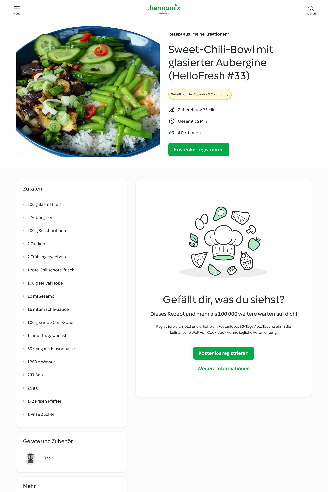
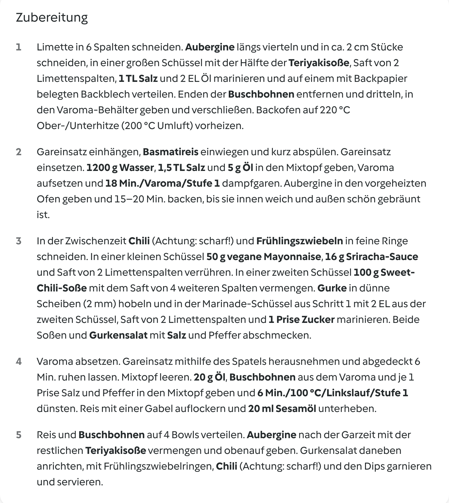
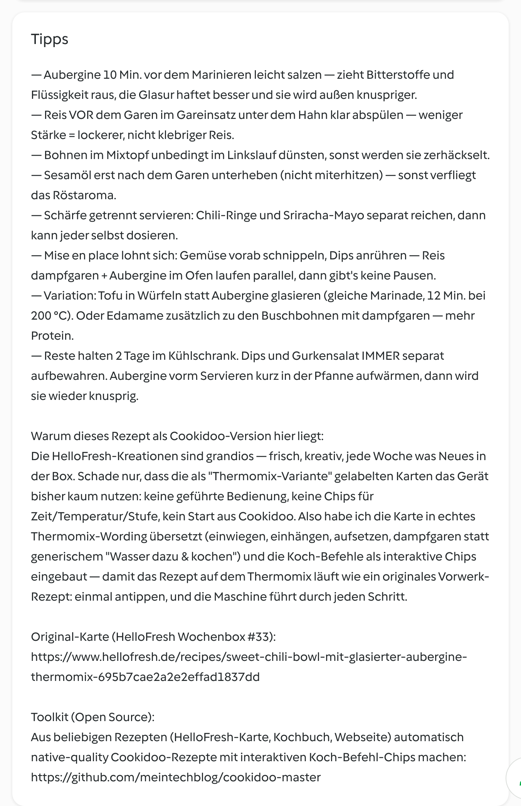

# [#33] Sweet-Chili-Bowl mit glasierter Aubergine

dazu Sesam-Reis, Gurkensalat & Sriracha-Mayo · vegan · ca. 610 kcal/Portion

## Kennzahlen

| | |
|---|---|
| **Quelle** | HelloFresh Wochenbox, Karte #33 |
| **Portionen** | 4 |
| **Arbeitszeit** | ca. 25 Min. |
| **Gesamtzeit** | ca. 35 Min. |
| **Schwierigkeit** | einfach |
| **Diät** | vegan |
| **Cookidoo-Rezept (privat, eingeloggt)** | https://cookidoo.de/created-recipes/de-DE/01KRNNR72NTN1C0PTD67PA8W7D |
| **Cookidoo-Rezept (öffentlich)** | https://cookidoo.de/created-recipes/public/recipes/de-DE/01KRNNR72NTN1C0PTD67PA8W7D |
| **Original HelloFresh-Rezept** | https://www.hellofresh.de/recipes/sweet-chili-bowl-mit-glasierter-aubergine-thermomix-695b7cae2a2e2effad1837dd |
| **Foto** | © Jörg Hofmann (eigene Aufnahme) |

## Zutaten (4P)

- 300 g Basmatireis
- 2 Auberginen
- 200 g Buschbohnen
- 2 Gurken
- 2 Frühlingszwiebeln
- 1 rote Chilischote, frisch
- 100 g Teriyakisoße
- 20 ml Sesamöl
- 16 ml Sriracha-Sauce
- 100 g Sweet-Chili-Soße
- 2 Limetten, gewachst
- 50 g vegane Mayonnaise
- 1200 g Wasser
- 3 TL Salz
- 45 g Öl
- 1-2 Prisen Pfeffer
- 1 Prise Zucker

## Zubereitung — 15 Schritte mit interaktiven Koch-Befehlen

1. Backofen auf **220 °C** Ober-/Unterhitze vorheizen. **2 Limetten** heiß abwaschen, **2 TL Schale** abreiben und in je 6 Spalten schneiden.
2. **2 Auberginen** längs vierteln und in 2 cm Stücke schneiden.
3. Aubergine mit **50 g Teriyakisoße**, dem Saft von 2 Limettenspalten, **1 TL Salz** und **20 g Öl** marinieren und auf einem mit Backpapier belegten Backblech verteilen.
4. Enden von **200 g Buschbohnen** entfernen, dritteln und in den Varoma-Behälter geben.
5. **300 g Basmatireis** in den Gareinsatz einwiegen, kalt abspülen und einhängen.
6. **1200 g Wasser**, **1,5 TL Salz** und **5 g Öl** in den Mixtopf geben, Varoma mit den Bohnen aufsetzen und **`18 Min./Varoma/Stufe 1`** dampfgaren. Die Aubergine in den Ofen geben und 15–20 Min. backen.
7. In dieser Zeit **1 rote Chilischote** und **50 g Frühlingszwiebel** in feine Ringe schneiden.
8. **50 g vegane Mayonnaise**, **16 ml Sriracha-Sauce** und den Saft von 2 Limettenspalten verrühren.
9. **100 g Sweet-Chili-Soße** mit dem Saft von 4 Limettenspalten zu einem Dip vermengen.
10. **2 Gurken** in dünne Scheiben hobeln.
11. Die Gurkenscheiben mit 2 EL vom Dip, dem Saft von 2 Limettenspalten, der abgeriebenen Schale, **1 Prise Zucker**, Salz und Pfeffer marinieren.
12. Varoma absetzen, den Gareinsatz mit dem Reis mithilfe des Spatels herausnehmen und abgedeckt 6 Min. ruhen lassen.
13. Mixtopf leeren. **20 g Öl**, die Bohnen aus dem Varoma und je 1 Prise Salz und Pfeffer in den Mixtopf geben und **`6 Min./100 °C/Linkslauf/Stufe 1`** dünsten.
14. Den Reis mit einer Gabel auflockern, **20 ml Sesamöl** unterheben und mit den Bohnen auf 4 Bowls verteilen.
15. Die gebackene Aubergine mit den restlichen **50 g Teriyakisoße** vermengen und auf dem Reis anrichten. Gurkensalat daneben geben, mit Frühlingszwiebel, Chili und den beiden Dips garnieren und servieren.

- Aubergine 10 Min. vorm Marinieren leicht salzen — zieht Bitterstoffe, Glasur haftet besser.
- Reis vor dem Garen klar abspülen — lockerer statt klebrig.
- Bohnen im Mixtopf unbedingt im Linkslauf — sonst werden sie zerhäckselt.
- Sesamöl erst nach dem Garen unterheben — sonst verfliegt das Röstaroma.
- Chili und Sriracha-Mayo separat reichen — jeder dosiert die Schärfe selbst.

## Warum diese Cookidoo-Adaption

Die HelloFresh-Kreationen sind grandios — frisch, kreativ, jede Woche was Neues in der Box. Schade nur, dass die als „Thermomix-Variante" gelabelten Karten das Gerät bisher kaum nutzen: keine geführte Bedienung, keine Chips für Zeit/Temperatur/Stufe, kein Start aus Cookidoo. Effektiv ist die „Thermomix-Variante" auf der Rückseite der Karte der gleiche Fließtext wie die Pfannen-Variante — nur mit ein paar Sätzen wie _„Wasser dazu, kochen"_.

Für diese Cookidoo-Version habe ich die Karte deshalb komplett in **echtes Thermomix-Wording** übersetzt:

- **Native Verben** statt generischer Anweisungen: `einwiegen`, `einhängen`, `aufsetzen`, `dampfgaren`, `mithilfe des Spatels herausnehmen`, `unterheben`, `auf 4 Bowls verteilen` — die Verben, die der Thermomix-Display und Cookidoo selbst auch in originalen Vorwerk-Rezepten verwenden.
- **Step-Granularität nach Native-Standard**: 15 kurze Ein-Aktion-Schritte (Median ~110 statt vorher ~314 Zeichen). Jeder Schritt sagt in 2 Sekunden, was rein muss und welcher Koch-Befehl läuft; Parallelarbeit während Reis-Dampfgaren + Aubergine-Ofen ist per `In dieser Zeit …` gebündelt — so wie native Thermomix-Rezepte aufgebaut sind. Mengen gegen die HelloFresh-Quelle abgeglichen: **2 Limetten** (vorher fälschlich 1, obwohl die Schritte Saft von 10 Spalten brauchen) und die zuvor fehlende **Limettenschale** ergänzt.
- **Spezifische Mengen** statt Catch-all: `2 TL Salz`, `25 g Öl`, `1-2 Prisen Pfeffer`, `1 Prise Zucker` als separate Zutatenzeilen — nicht „Salz, Pfeffer, Zucker, Öl nach Bedarf" wie die HelloFresh-Karte. Damit kennt der Thermomix die Mengen exakt.
- **Interaktive Koch-Befehl-Chips**: `18 Min./Varoma/Stufe 1` und `6 Min./100 °C/Linkslauf/Stufe 1` sind im Cookidoo-Render keine Plain-Text-Strings, sondern hervorgehobene Chips. Der Thermomix erkennt sie und führt sie beim Antippen direkt aus — die Maschine dreht den Mixer wirklich 18 Minuten auf Varoma/Stufe 1, ohne dass man am Display Werte eintippen muss.

Erstellt mit dem Open-Source-Toolkit [thermomix-master](https://github.com/meintechblog/thermomix-master), das beliebige Rezepte (HelloFresh-Karte, Kochbuch, Webseite) in ~2 Minuten in native-quality Cookidoo-Eigene-Rezepte umwandelt.

## So sieht's live auf Cookidoo aus

Öffentliche Vorschau (ohne Cookidoo-Login einsehbar) — die Eigenen Rezepte bekommen den gleichen Render wie originale Vorwerk-Rezepte:

Die Zubereitung mit den hervorgehobenen Koch-Befehlen (im View nur für eingeloggte Cookidoo-Nutzer):

Tipps + Quellen-Narrativ als eigene Sektion unterhalb der Schritte:

## Nährwerte pro Portion (ca. 700 g)

| | |
|---|---|
| Brennwert | 2553 kJ / 610 kcal |
| Fett | 22,1 g (davon ges. Fettsäuren 6,7 g) |
| Kohlenhydrate | 97,8 g (davon Zucker 27,3 g) |
| Eiweiß | 12,5 g |
| Salz | 2,96 g |

## Quelle & Lizenz

Original-Rezept stammt aus der HelloFresh-Wochenbox („Sweet-Chili-Bowl mit glasierter Aubergine", Karte #33, Variante „Thermomix kocht"). Die Anpassung (Schritt-Reihenfolge, Sprache, Mengen-Konsistenz, Tipps) ist die Eigenarbeit für die Cookidoo-Version.

Das Hero-Bild ist eine **eigene Aufnahme** (© Jörg Hofmann, 2026) — daher kann das Rezept auf Cookidoo öffentlich geteilt werden.
