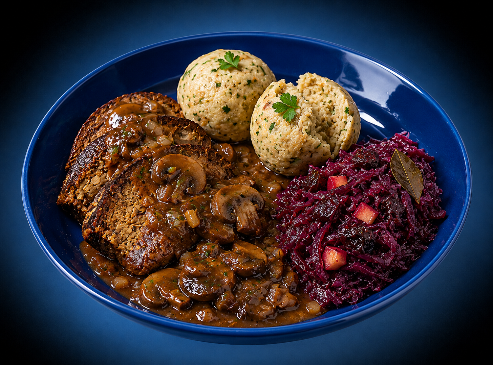

# Veganer Hackbraten mit Semmelknödeln, Schwarzbier-Pilz-Rahm & Apfel-Rotkohl

Wirtshaus-Klassiker im Thermomix · vegan · 4 Portionen · ca. 720 kcal/Portion

## Kennzahlen

| | |
|---|---|
| **Quelle** | Eigenkreation (Jörg Hofmann, 2026) — Beilagen-Klassiker neu im Thermomix-Sequencing |
| **Portionen** | 4 |
| **Arbeitszeit** | ca. 20 Min. |
| **Gesamtzeit** | ca. 45 Min. |
| **Schwierigkeit** | mittel |
| **Diät** | vegan |
| **Hauptprodukt** | Planeo Bio Veganer Festtags-Hackbraten (500 g, am Stück) — https://planeofood.de/products/planeo-bio-veganer-festtags-hackbraten |
| **Cookidoo-Rezept (privat, eingeloggt)** | _(wird beim Push gesetzt)_ |
| **Cookidoo-Rezept (öffentlich)** | _(wird beim Public-Publish gesetzt)_ |
| **Foto** | AI-Vorab-Bild (gleicher Studio-Stil wie unsere anderen Rezepte) — wird beim ersten Kochen durch eigenes Foto ersetzt, dann Public-Publish auf Cookidoo |

## Zutaten (4P)

**Für den Hackbraten**
- 500 g veganer Hackbraten (Planeo Bio, am Stück)
- 25 g Öl, zum Anbraten
- 1 Prise Pfeffer

**Für die Semmelknödel (8 Stück)**
- 250 g Knödelbrot (oder 5 alte Brötchen, in dünne Scheiben)
- 250 g Hafermilch
- 30 g vegane Margarine
- 2 EL Sojamehl (statt Ei)
- 15 g glatte Petersilie (ca. 1 Bund)
- 1 TL Salz
- 1 Prise Muskat

**Für die Schwarzbier-Pilz-Rahmsoße**
- 1 große Zwiebel (ca. 150 g)
- 2 Knoblauchzehen
- 400 g braune Champignons
- 30 g Öl
- 1 EL Tomatenmark
- 1 TL Senf, mittelscharf
- 200 g Schwarzbier (z.B. Köstritzer)
- 300 g Gemüsebrühe
- 200 g Hafer-Cuisine (oder Soja-Cuisine)
- 1 EL Sojasoße
- 1 TL geräuchertes Paprikapulver
- 1 TL Mehl
- 1 Prise Pfeffer

**Für den Apfel-Rotkohl**
- 500 g Rotkohl, fertig gegart (aus dem Glas, z.B. Hengstenberg)
- 1 säuerlicher Apfel (Boskoop oder Braeburn)
- 50 g getrocknete Zwetschgen, entsteint
- 1 EL Rotweinessig
- 1 EL Zucker
- 1 Lorbeerblatt
- 1 Prise Salz

## Zubereitung — 6 Schritte mit interaktiven Koch-Befehlen

1. Rotkohl (aus dem Glas) in einen kleinen Topf geben. Apfel entkernen und in feine Würfel schneiden, Zwetschgen in schmale Streifen, beides mit Rotweinessig, Zucker, Lorbeerblatt und 1 Prise Salz dazugeben und einmal kurz durchmischen. Beiseitestellen — zieht durch, während die Soße läuft.

2. Knödelbrot in eine große Schüssel geben. Hafermilch in den Mixtopf einwiegen und **`5 Min./50 °C/Stufe 1`** erwärmen, dann gleichmäßig darübergießen. Mixtopf spülen. 10 Min ziehen lassen.

3. Inzwischen Zwiebel halbieren, Knoblauch schälen, Petersilienblätter abzupfen. Alles zusammen in den Mixtopf geben und **`4 Sek./Stufe 5`** zerkleinern. Mit dem Spatel umfüllen: etwa ein Drittel der Mischung (Petersilie + ein EL davon) zur Knödelmasse geben, Rest im Mixtopf lassen. Margarine schmelzen und ebenfalls zur Knödelmasse geben. Sojamehl mit 4 EL Wasser glatt rühren, dazugeben. Mit Salz und Muskat würzen und kräftig durchkneten — die Masse soll sich glatt formen lassen. 8 gleichgroße Knödel (ca. 70 g) formen und in den mit Backpapier ausgelegten Varoma-Behälter setzen.

4. Champignons putzen, halbieren und in den Mixtopf zur restlichen Zwiebel-Knoblauch-Mischung geben, **`3 Sek./Stufe 5/Linkslauf`** grob zerkleinern. Öl, Tomatenmark, Senf und geräuchertes Paprikapulver dazu, **`2 Min./Varoma/Linkslauf/Stufe 1`** anrösten.

5. Schwarzbier, Gemüsebrühe und Sojasoße angießen, Mehl und Hafer-Cuisine unterheben. Varoma mit den Knödeln aufsetzen und **`25 Min./Varoma/Linkslauf/Stufe 1`** garen — Knödel werden dampfgegart, gleichzeitig reduziert die Soße. In den letzten 8 Min Rotkohl bei mittlerer Hitze in seinem Topf zugedeckt köcheln lassen, dann auf kleinste Stufe stellen. In den letzten 5 Min Hackbraten in ca. 1,5 cm dicke Scheiben schneiden, in einer beschichteten Pfanne mit 25 g Öl von jeder Seite 2 Min goldbraun braten und mit 1 Prise Pfeffer würzen.

6. Varoma absetzen, Knödel mithilfe des Spatels herausnehmen. Soße mit Salz und Pfeffer abschmecken. Auf 4 Tellern jeweils 2 Knödel anrichten, 2-3 Hackbraten-Scheiben daneben legen und großzügig mit Schwarzbier-Pilz-Rahm überziehen. Lorbeerblatt aus dem Rotkohl fischen und eine Portion auf jedem Teller anrichten.

## Tipps

- **Knödelbrot statt frische Brötchen** — wenn du es eilig hast, kauf fertiges Knödelbrot (250 g im Beutel). Saugt gleichmäßiger als selbst geschnittene Brötchen, Knödel werden fluffiger.
- **Sojamehl + Wasser ersetzt 1 Ei** als Bindung. Vor dem Unterkneten 2 Min quellen lassen — wirkt sonst weniger. Alternative: 1 EL Leinsamen geschrotet + 3 EL Wasser, ebenfalls gequollen.
- **Schwarzbier statt Lager** ist der Geschmacksunterschied der Soße: dunkles Bier bringt Röstaromen + leichte Bitterkeit, die den Lupinen-Seitan-Braten erst richtig aufwerten. Köstritzer, Erdinger Schwarz oder Mönchshof tun's. Helles Bier macht die Soße flach.
- **Champignons mit Linkslauf** zerkleinern, sonst werden sie püriert. Linkslauf hält Stücke, der Drehflügel "schiebt" statt zu schneiden.
- **Knödel im Varoma niemals stapeln** — sie kleben sonst zusammen. Wenn 8 Knödel nicht nebeneinander passen: 4 im Behälter, 4 im Varoma-Tablett darüber.
- **Hackbraten in Scheiben statt am Stück**: Hersteller-Empfehlung ist „anbraten und in Soße schmoren", aber Scheiben werden außen knusprig (Maillard-Reaktion) und das ist Geschmacks-Gold. Wenn du Reste hast: am nächsten Tag in der Soße aufwärmen.
- **Rotkohl-Boost im Glas**: fertiger Rotkohl ist OK, wird aber erst geil durch Apfel + Zwetschge + Rotweinessig + ein Schluck Rotwein (optional, 2 EL beim Köcheln). Das ist der Unterschied zwischen „Beilage aus dem Glas" und „Wirtshausqualität".
- **Reste** halten 2 Tage im Kühlschrank. Knödel separat aufbewahren (sonst werden sie matschig), am nächsten Tag in Scheiben in der Pfanne mit etwas Öl braten — „Knödel-Carpaccio", als Beilage zu Pilzen, Spinat oder einfach Spiegelei (oder vegane Pendants).
- **Variation Maultaschen-Style**: Knödel mit Spinat-Tofu-Füllung formen (50 g Tofu + 50 g Blattspinat gehackt) — kompliziert macht's, aber dann hast du gefüllte Knödel als Show-Stück. Garzeit gleich.

## Warum diese Cookidoo-Adaption

Veganer Hackbraten + Knödel + Rotkohl ist DAS Sonntagsessen, das viele Familien aus der Fleisch-Welt mitbringen wollen — aber die meisten Rezepte machen es zur Geduldsprobe: Knödel kochen im Topf 1, Pilzsoße in Pfanne 2, Rotkohl in Topf 3, Hackbraten im Ofen, Geschirr für drei Tage. Das geht im Thermomix radikal anders, weil Mixtopf + Varoma genau dafür gebaut sind: **zwei Komponenten gleichzeitig in einem Gerät**.

Was die Cookidoo-Version anders macht:

- **Mixtopf + Varoma als Parallel-Maschine**: Die Soße reduziert UNTEN, Knödel dampfgaren OBEN — beides läuft in den gleichen 25 Minuten ab. Spart Topf, Wasser, Energie und vor allem Konzentration (kein „Knödel umrühren!"-Stress nebenbei).
- **Aromaten in EINER Zerkleinerungs-Aktion**: Zwiebel + Knoblauch + Petersilie kommen gemeinsam in den Mixtopf für Knödel UND Soße — danach mit dem Spatel teilen. Statt zweimal zerkleinern, einmal zerkleinern, einmal teilen.
- **Interaktive Koch-Befehl-Chips**: `5 Min./50 °C/Stufe 1`, `4 Sek./Stufe 5`, `3 Sek./Stufe 5/Linkslauf`, `2 Min./Varoma/Linkslauf/Stufe 1` und `25 Min./Varoma/Linkslauf/Stufe 1` sind im Cookidoo-Render keine Plain-Text-Strings, sondern hervorgehobene Chips. Der Thermomix erkennt sie und führt sie beim Antippen direkt aus — niemand tippt am Display Zahlen ein.
- **Hackbraten in der Pfanne, nicht im Mixtopf**: Der Planeo-Braten ist am Stück, würde im Mixtopf seine Struktur verlieren. Die Pfanne mit 25 g Öl gibt ihm außen die Maillard-Kruste, die ihn vom „Versuchten" zum „Versprochenen" macht. Drei Minuten Aufwand, riesiger Geschmacks-Hebel.

Erstellt mit dem Open-Source-Toolkit [cookidoo-master](https://github.com/meintechblog/cookidoo-master), das beliebige Rezepte (HelloFresh-Karte, Kochbuch, Eigenkreation) in ~2 Minuten in native-quality Cookidoo-Eigene-Rezepte umwandelt.

## Nährwerte pro Portion (Schätzung, ca. 500 g)

| | |
|---|---|
| Brennwert | 3013 kJ / 720 kcal |
| Fett | 27 g (davon ges. Fettsäuren 4 g) |
| Kohlenhydrate | 78 g (davon Zucker 16 g) |
| Eiweiß | 32 g |
| Salz | 3,4 g |

Werte sind eine Schätzung aus Planeo-Nährwerten (231 kcal/100g × 125 g) + typische Werte für Knödel, Soße und Rotkohl pro Portion. Erst beim Kochen exakt nachrechnen, falls nötig.

## Quelle & Lizenz

Eigenkreation (© Jörg Hofmann, 2026). Hauptprodukt ist der Planeo Bio Veganer Festtags-Hackbraten — der ist gewerblich erworben und das Rezept beschreibt nur die Zubereitung drumherum, kein Reverse-Engineering.

Das Hero-Foto wird beim ersten Kochen aufgenommen (eigenes Foto, daher Cookidoo-Public-Sharing erlaubt).
