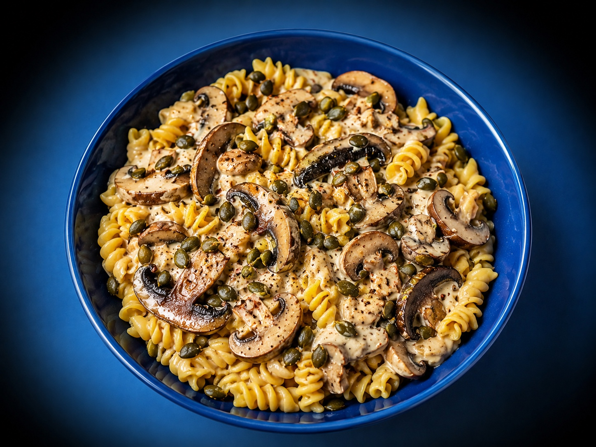
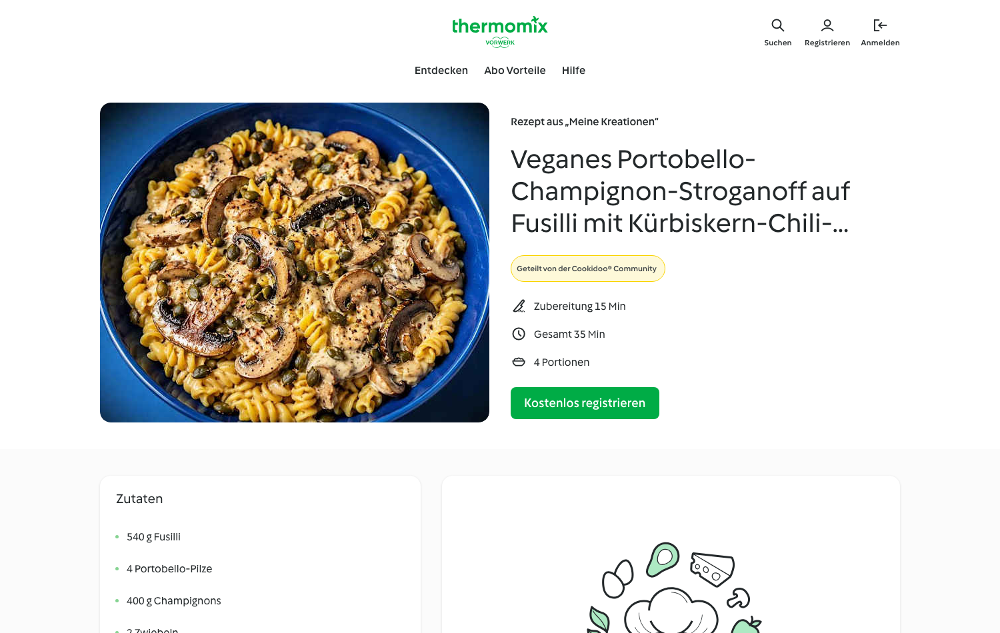
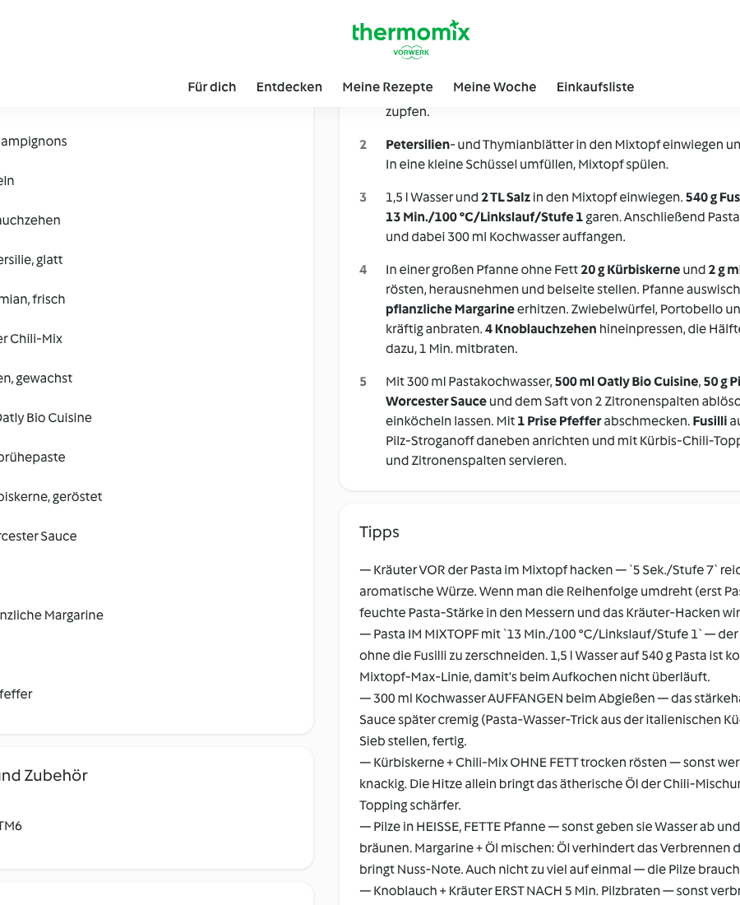
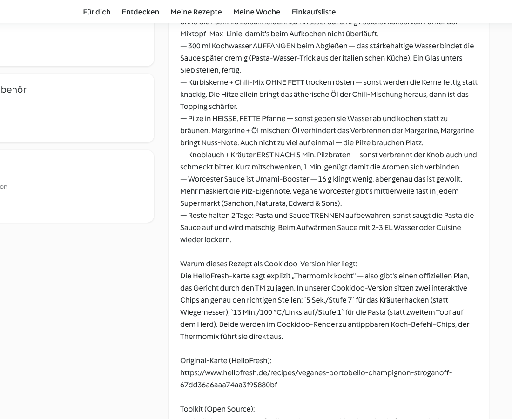

# Veganes Portobello-Champignon-Stroganoff

auf Fusilli mit Kürbiskern-Chili-Topping · vegan · 4 Portionen

## Kennzahlen

| | |
|---|---|
| **Quelle** | HelloFresh Wochenbox, Karte #33 (HF_Y25_R32_W28, vegan) |
| **Portionen** | 4 |
| **Arbeitszeit** | ca. 15 Min. |
| **Gesamtzeit** | ca. 35 Min. |
| **Schwierigkeit** | einfach |
| **Diät** | vegan |
| **Cookidoo-Rezept (privat, eingeloggt)** | https://cookidoo.de/created-recipes/de-DE/01KSMWEF8YNKG04Z4TTE9E72EA |
| **Cookidoo-Rezept (öffentlich)** | https://cookidoo.de/created-recipes/public/recipes/de-DE/01KSMWEF8YNKG04Z4TTE9E72EA |
| **Original HelloFresh-Rezept** | https://www.hellofresh.de/recipes/veganes-portobello-champignon-stroganoff-67dd36a6aaa74aa3f95880bf |
| **Foto** | AI-Vorab-Bild (eigene Generierung mit ChatGPT image-1, Style-Referenzen aus eigener Rezeptesammlung, Copyright Jörg Hofmann) — wird beim ersten Kochen durch eigenes Plattenfoto ersetzt |

## Zutaten (4P)

- 540 g Fusilli
- 4 Portobello-Pilze
- 400 g Champignons
- 2 Zwiebeln
- 4 Knoblauchzehen
- 10 g Petersilie, glatt
- 10 g Thymian, frisch
- 2 g milder Chili-Mix
- 2 Zitronen, gewachst
- 500 ml Oatly Bio Cuisine
- 50 g Pilzbrühepaste
- 20 g Kürbiskerne, geröstet
- 16 g Worcester Sauce
- 30 g Öl
- 50 g pflanzliche Margarine
- 2 TL Salz
- 1 Prise Pfeffer

## Zubereitung — 5 Schritte mit interaktiven Koch-Befehlen

1. **2 Zitronen** heiß abwaschen und jeweils in 4 Spalten schneiden. **2 Zwiebeln** grob würfeln. **4 Portobello-Pilze** in 0,5 cm Scheiben schneiden. **400 g Champignons** je nach Größe halbieren oder vierteln. **10 g Petersilie** und **10 g Thymian** von den Stielen zupfen.
2. Petersilien- und Thymianblätter in den Mixtopf einwiegen und **`5 Sek./Stufe 7`** hacken. In eine kleine Schüssel umfüllen, Mixtopf spülen.
3. 1,5 l Wasser und **2 TL Salz** in den Mixtopf einwiegen. **540 g Fusilli** hinzugeben und **`13 Min./100 °C/Linkslauf/Stufe 1`** garen. Anschließend Pasta in einem Sieb abgießen und dabei 300 ml Kochwasser auffangen.
4. In einer großen Pfanne ohne Fett **20 g Kürbiskerne** und **2 g milden Chili-Mix** 2–3 Min. rösten, herausnehmen und beiseite stellen. Pfanne auswischen, **30 g Öl** und **50 g pflanzliche Margarine** erhitzen. Zwiebelwürfel, Portobello und Champignons 5–6 Min. kräftig anbraten. **4 Knoblauchzehen** hineinpressen, die Hälfte der gehackten Kräuter dazu, 1 Min. mitbraten.
5. Mit 300 ml Pastakochwasser, **500 ml Oatly Bio Cuisine**, **50 g Pilzbrühepaste**, **16 g Worcester Sauce** und dem Saft von 2 Zitronenspalten ablöschen, 2–3 Min. cremig einköcheln lassen. Mit **1 Prise Pfeffer** abschmecken. Fusilli auf 4 tiefe Teller verteilen, Pilz-Stroganoff daneben anrichten und mit Kürbis-Chili-Topping, restlichen Kräutern und Zitronenspalten servieren.

## Tipps

- **Kräuter VOR der Pasta im Mixtopf hacken** — `5 Sek./Stufe 7` reicht für eine grobe, aromatische Würze. Wenn man die Reihenfolge umdreht (erst Pasta, dann Kräuter), klebt feuchte Pasta-Stärke in den Messern und das Kräuter-Hacken wird matschig.
- **Pasta IM MIXTOPF mit `13 Min./100 °C/Linkslauf/Stufe 1`** — der Linkslauf rührt vorsichtig ohne die Fusilli zu zerschneiden. 1,5 l Wasser auf 540 g Pasta ist konservativ unter der Mixtopf-Max-Linie, damit's beim Aufkochen nicht überläuft.
- **300 ml Kochwasser AUFFANGEN** beim Abgießen — das stärkehaltige Wasser bindet die Sauce später cremig (Pasta-Wasser-Trick aus der italienischen Küche). Ein Glas unters Sieb stellen, fertig.
- **Kürbiskerne + Chili-Mix OHNE FETT trocken rösten** — sonst werden die Kerne fettig statt knackig. Die Hitze allein bringt das ätherische Öl der Chili-Mischung heraus, dann ist das Topping schärfer.
- **Pilze in HEISSE, FETTE Pfanne** — sonst geben sie Wasser ab und kochen statt zu bräunen. Margarine + Öl mischen: Öl verhindert das Verbrennen der Margarine, Margarine bringt Nuss-Note. Auch nicht zu viel auf einmal — die Pilze brauchen Platz.
- **Knoblauch + Kräuter ERST NACH 5 Min. Pilzbraten** — sonst verbrennt der Knoblauch und schmeckt bitter. Kurz mitschwenken, 1 Min. genügt damit die Aromen sich verbinden.
- **Worcester Sauce ist Umami-Booster** — 16 g klingt wenig, aber genau das ist gewollt. Mehr maskiert die Pilz-Eigennote. Vegane Worcester gibt's mittlerweile fast in jedem Supermarkt (Sanchon, Naturata, Edward & Sons).
- **Reste** halten 2 Tage: Pasta und Sauce TRENNEN aufbewahren, sonst saugt die Pasta die Sauce auf und wird matschig. Beim Aufwärmen Sauce mit 2–3 EL Wasser oder Cuisine wieder lockern.

## Warum diese Cookidoo-Adaption

Die HelloFresh-Karte sagt explizit „Thermomix kocht" — also gibt's einen offiziellen Plan, das Gericht durch den TM zu jagen. In unserer Cookidoo-Version sitzen zwei interaktive Chips an genau den richtigen Stellen: `5 Sek./Stufe 7` für das Kräuterhacken (statt Wiegemesser), `13 Min./100 °C/Linkslauf/Stufe 1` für die Pasta (statt zweitem Topf auf dem Herd). Beide werden im Cookidoo-Render zu antippbaren Koch-Befehl-Chips, der Thermomix führt sie direkt aus.

Für diese Cookidoo-Version:

- **Native Verben**: `einwiegen`, `umfüllen`, `mithilfe des Spatels herausnehmen`, `auf 4 tiefe Teller verteilen`, `... servieren` (Mixtopf-Pattern).
- **Zwei interaktive Koch-Befehl-Chips**: `5 Sek./Stufe 7` für Kräuter-Hacken, `13 Min./100 °C/Linkslauf/Stufe 1` für Pasta-Garen — beide werden im Cookidoo-Render zu hervorgehobenen Chips.
- **Spezifische Mengen** statt Catch-all: `2 TL Salz`, `30 g Öl`, `50 g pflanzliche Margarine`, `1 Prise Pfeffer` als eigene Zutatenzeilen.
- **Adjektive nach Komma**: `Petersilie, glatt`, `Thymian, frisch`, `Zitronen, gewachst`, `Kürbiskerne, geröstet` (Native-Vorwerk-Schema).

Erstellt mit dem Open-Source-Toolkit [cookidoo-master](https://github.com/meintechblog/cookidoo-master), das beliebige Rezepte in ~3–5 Minuten in native-quality Cookidoo-Eigene-Rezepte umwandelt.

## So sieht's live auf Cookidoo aus

Öffentliche Vorschau (ohne Cookidoo-Login einsehbar):

Die Zubereitung mit den hervorgehobenen Koch-Befehlen:

Tipps + Quellen-Narrativ:

## Quelle & Lizenz

Original-Rezept stammt aus der HelloFresh-Wochenbox („Veganes Portobello-Champignon-Stroganoff auf Fusilli mit Kürbiskern-Chili-Topping", Karte #33, vegan). Die Anpassung (Kräuter im Mixtopf, Pasta im Mixtopf mit Linkslauf, Mengen-Konsistenz, Tipps) ist die Eigenarbeit für die Cookidoo-Version.

Das Hero-Bild ist ein **AI-Vorab-Bild** (eigene Generierung mit ChatGPT image-1, Style-Referenzen aus der eigenen Rezeptesammlung — © Jörg Hofmann, 2026) und wird beim ersten tatsächlichen Kochen durch ein eigenes Plattenfoto ersetzt. Bis dahin gilt: kein fremdes Fotomaterial verwendet, Cookidoo-Public-Sharing daher zulässig.
